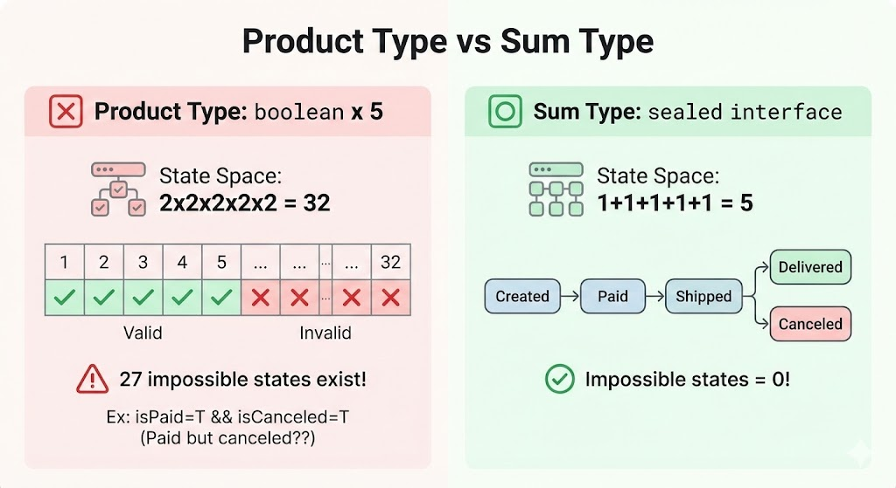

# Chapter 3: 타입 시스템의 기수 이론 (Type System Cardinality Theory)

## 학습 목표 (Learning Objectives)
1. 기수(Cardinality)의 개념을 이해하고 타입의 상태 개수를 계산할 수 있다
2. 곱 타입(Product Type)이 상태 폭발을 일으키는 원리를 설명할 수 있다
3. 합 타입(Sum Type)이 상태를 축소하는 원리를 설명할 수 있다
4. Sealed Interface를 사용해 합 타입을 구현할 수 있다
5. 실제 도메인에서 상태 수를 계산하고 최적화할 수 있다

---

## 3.1 기수란? (What is Cardinality?)

> **다른 말로 (In other words):**
> - "타입이 표현할 수 있는 가능한 값의 개수"
> - "복잡도 ∝ 기수, 기수가 클수록 시스템이 복잡해진다"

> **🎯 왜 배우는가?**
>
> "이 코드는 왜 이렇게 복잡한 거지?"라고 느낀 적 있으신가요?
> 기수 이론을 이해하면 **복잡도의 원인을 수치로 정량화**할 수 있고,
> 타입 설계만으로 버그 발생 가능성을 수학적으로 줄일 수 있습니다.

시스템의 복잡도는 **"가능한 상태의 총 개수(Cardinality)"**와 비례합니다.

```
복잡도 ∝ 가능한 상태의 수 (Cardinality)
```

**Table 3.1**: 주요 타입별 기수(Cardinality)

| 타입                      | 기수(Cardinality) |
| ------------------------- | ----------------- |
| `boolean`                 | 2 (true, false)   |
| `byte`                    | 256               |
| `int`                     | 2^32 ≈ 40억       |
| `String`                  | ∞ (무한)          |
| `Optional<T>`             | \|T\| + 1         |
| `enum Status { A, B, C }` | 3                 |

---

## 3.2 곱 타입: 상태의 폭발 (Product Type: State Explosion)

> **다른 말로 (In other words):**
> - "필드를 추가하면 상태 수가 곱셈으로 증가 (2×2×2 = 8)"
> - "boolean 5개 = 32가지 상태, 대부분은 불가능한 상태"

> **🎯 왜 배우는가?**
>
> boolean 필드 5개만 추가했는데 왜 테스트 케이스가 32개나 필요한 걸까요?
> 곱 타입의 상태 폭발 원리를 이해하면 **왜 필드를 무분별하게 추가하면 안 되는지** 명확히 알 수 있고,
> 합 타입으로 상태를 축소하는 동기를 얻을 수 있습니다.

필드를 추가하는 것은 경우의 수를 **곱하는(Multiply)** 행위입니다.

> **Visual Reference - Algebraic Data Types:**
> For theoretical foundation, see [Stanford CS 242 - Algebraic Data Types](https://stanford-cs242.github.io/f19/lectures/03-2-algebraic-data-types.html)
> For practical examples, see [DEV Community - Functional Design ADTs](https://dev.to/gcanti/functional-design-algebraic-data-types-36kf)

### 곱타입 vs 합타입 상태 공간 시각화

**Figure 3.1**: Product Type vs Sum Type State Space

```
┌───────────────────────────────────────────────────────────────────────┐
│                    Product Type vs Sum Type                           │
├───────────────────────────────────┬───────────────────────────────────┤
│  [X] Product Type: boolean x 5    │  [O] Sum Type: sealed interface   │
├───────────────────────────────────┼───────────────────────────────────┤
│                                   │                                   │
│  State Space: 2x2x2x2x2 = 32      │  State Space: 1+1+1+1+1 = 5       │
│                                   │                                   │
│  ┌───┬───┬───┬───┬───┬─────┬───┐  │  ┌─────────┐                      │
│  │ 1 │ 2 │ 3 │ 4 │ 5 │ ... │32 │  │  │ Created │                      │
│  ├───┼───┼───┼───┼───┼─────┼───┤  │  └────┬────┘                      │
│  │ o │ o │ o │ o │ o │  x  │ x │  │       │                           │
│  └───┴───┴───┴───┴───┴─────┴───┘  │       v                           │
│   Valid Valid Valid ... Invalid   │  ┌─────────┐                      │
│                                   │  │  Paid   │                      │
│  27 impossible states exist!      │  └────┬────┘                      │
│                                   │       │                           │
│  Ex: isPaid=T && isCanceled=T     │       v                           │
│      (Paid but canceled??)        │  ┌─────────┐                      │
│                                   │  │ Shipped │                      │
│                                   │  └────┬────┘                      │
│                                   │       │                           │
│                                   │       v                           │
│                                   │  ┌──────────┐  ┌──────────┐       │
│                                   │  │Delivered │  │ Canceled │       │
│                                   │  └──────────┘  └──────────┘       │
│                                   │                                   │
│                                   │  Impossible states = 0!           │
└───────────────────────────────────┴───────────────────────────────────┘
```


### ❌ 안티패턴: Boolean 필드로 상태 표현

**왜 문제인가?**
- **조합 폭발**: 5개의 boolean = 32가지 상태 중 유효한 건 5개뿐
- **불가능한 상태 표현 가능**: `isPaid=true && isCanceled=true` 같은 모순 상태 허용
- **검증 코드 필수**: 모든 비즈니스 로직에 상태 검증 필요

**Code 3.1**: 곱 타입으로 인한 상태 폭발 (안티패턴)
```java
// 각 boolean 필드는 2가지 상태
class Order {
    boolean isCreated;    // 2가지
    boolean isPaid;       // 2가지
    boolean isShipped;    // 2가지
    boolean isDelivered;  // 2가지
    boolean isCanceled;   // 2가지
}
// 총 상태 수 = 2 × 2 × 2 × 2 × 2 = 32가지
// 하지만 유효한 상태는 단 5가지뿐!
// 나머지 27가지는 "불가능한 상태"
```

### ✅ 권장패턴: Sealed Interface로 상태 제한

**왜 좋은가?**
- **정확한 상태 수**: 딱 5가지 유효한 상태만 표현 가능
- **불가능한 상태 차단**: 타입 시스템이 모순 상태를 컴파일 에러로 방지
- **상태별 데이터**: 각 상태에 필요한 데이터만 포함

**Code 3.2**: 합 타입으로 상태 축소 (DOP 권장)
```java
// 합 타입: 5가지 상태만 가능
sealed interface OrderStatus permits
    Created, Paid, Shipped, Delivered, Canceled {}

record Created(LocalDateTime at) implements OrderStatus {}
record Paid(LocalDateTime at, PaymentId paymentId) implements OrderStatus {}
record Shipped(LocalDateTime at, TrackingNumber tracking) implements OrderStatus {}
record Delivered(LocalDateTime at, ReceiverName receiver) implements OrderStatus {}
record Canceled(LocalDateTime at, CancelReason reason) implements OrderStatus {}

// 총 상태 수 = 1 + 1 + 1 + 1 + 1 = 5가지
// 복잡도가 84% 감소!
```

> **💡 Q&A: Record를 sealed interface 안에? 밖에?**
>
> **두 가지 스타일:**
>
> ```java
> // 스타일 A: 외부 정의 (Top-level)
> sealed interface OrderStatus permits Created, Paid, Shipped {}
> record Created(LocalDateTime at) implements OrderStatus {}
> record Paid(LocalDateTime at, PaymentId id) implements OrderStatus {}
> record Shipped(LocalDateTime at, TrackingNumber num) implements OrderStatus {}
>
> // 스타일 B: 내부 정의 (Nested)
> sealed interface OrderStatus {
>     record Created(LocalDateTime at) implements OrderStatus {}
>     record Paid(LocalDateTime at, PaymentId id) implements OrderStatus {}
>     record Shipped(LocalDateTime at, TrackingNumber num) implements OrderStatus {}
> }
> ```
>
> **차이점 비교:**
>
> | 구분 | 외부 정의 (Top-level) | 내부 정의 (Nested) |
> |-----|---------------------|-------------------|
> | 접근 방식 | `new Created(...)` | `new OrderStatus.Created(...)` |
> | `permits` 절 | 필수 | 생략 가능 (암묵적) |
> | 파일 분리 | 각 record별 파일 가능 | 하나의 파일에 집중 |
> | 네임스페이스 | 전역에 노출 | `OrderStatus.` 하위에 캡슐화 |
> | 패턴 매칭 | `case Created c` | `case OrderStatus.Created c` |
>
> **언제 어떤 스타일을 쓸까?**
>
> | 상황 | 권장 스타일 | 이유 |
> |-----|-----------|------|
> | **독립적으로 의미 있는 타입** | 외부 정의 | `Money`, `Address` 등은 다른 곳에서도 재사용 |
> | **부모 타입 없이 의미 없는 타입** | 내부 정의 | `OrderStatus.Created`는 `OrderStatus` 맥락에서만 의미 |
> | **파일당 하나의 public 클래스 규칙** | 외부 정의 | 각 variant를 별도 파일로 관리 가능 |
> | **응집도 높은 ADT** | 내부 정의 | 모든 variant를 한눈에 파악 |
>
> **실무 가이드라인:**
> - **상태/이벤트 타입** (OrderStatus, PaymentEvent) → 내부 정의 권장
> - **도메인 엔티티/값 객체** (Member, Product, Money) → 외부 정의 권장
> - **팀 컨벤션이 있다면** → 팀 규칙 우선

---

## 3.3 enum vs sealed interface (Enum vs Sealed Interface)

> **다른 말로 (In other words):**
> - "enum: 모든 상수가 동일한 구조 (필드가 같음)"
> - "sealed interface: 각 상태마다 다른 데이터를 가질 수 있음"

> **🎯 왜 배우는가?**
>
> "enum이면 충분한데 왜 sealed interface를 써야 하지?"라는 의문이 드시나요?
> 각 도구의 적합한 사용처를 이해하면 **상태별로 다른 데이터를 우아하게 표현**할 수 있고,
> 타입 안전한 도메인 모델을 설계할 수 있습니다.

> **💡 Q&A: enum으로도 충분하지 않나요?**
>
> **결론**: 데이터의 모양(구조)이 다를 수 있느냐가 결정적인 차이입니다.

**Code 3.3**: Enum의 한계 - 모든 상수가 같은 구조
```java
public enum DeliveryStatus {
    PREPARING(null, null),     // 불필요한 null
    SHIPPED("12345", null),    // 배송일시는 null
    DELIVERED("12345", LocalDateTime.now());

    private final String trackingNumber;  // 모든 필드를 가져야 함
    private final LocalDateTime deliveredAt;
}
```

**Code 3.4**: Sealed Interface의 강점 - 각 상태마다 다른 데이터
```java
sealed interface DeliveryStatus {}
record Preparing() implements DeliveryStatus {}  // 아무것도 없음
record Shipped(String trackingNumber) implements DeliveryStatus {}  // 송장만
record Delivered(String trackingNumber, LocalDateTime deliveredAt)
    implements DeliveryStatus {}  // 송장 + 시간
```

---

## 퀴즈 Chapter 3 (Quiz Chapter 3)

### Q3.1 [개념 확인] 기수 계산
다음 타입의 기수(Cardinality)는?

```java
enum Size { S, M, L, XL }
enum Color { RED, BLUE, GREEN }

record Product(Size size, Color color) {}
```

A. 7 (4 + 3)<br/>
B. 12 (4 × 3)<br/>
C. 16 (4^2)<br/>
D. 81 (3^4)

---

### Q3.2 [함정 문제] 봉인된 운명 ⭐
다음과 같이 완벽한 sealed interface와 switch 문을 작성하여 배포했습니다.

```java
public sealed interface LoginResult permits Success, Failure {}
public record Success() implements LoginResult {}
public record Failure(String reason) implements LoginResult {}

// 로직 코드
public String handleLogin(LoginResult result) {
    return switch (result) {
        case Success s -> "Welcome!";
        case Failure f -> "Error: " + f.reason();
    };
}
```

일주일 뒤, 동료가 `LoginResult`에 `record Timeout() implements LoginResult {}`를 추가하고
`permits` 절에도 `Timeout`을 넣었습니다. 하지만 `handleLogin` 메서드는 수정하지 않았습니다.

이때 컴파일러의 반응은?

A. 에러 없음: 런타임에 Timeout이 들어오면 예외 발생<br/>
B. 컴파일 에러: switch 식이 모든 경우를 커버하지 않음<br/>
C. 에러 없음: Timeout은 자동으로 무시됨 (null 반환)<br/>
D. 워닝(Warning): "모든 케이스를 다루지 않았습니다" 경고만 발생

---

정답은 Appendix C에서 확인할 수 있습니다.
