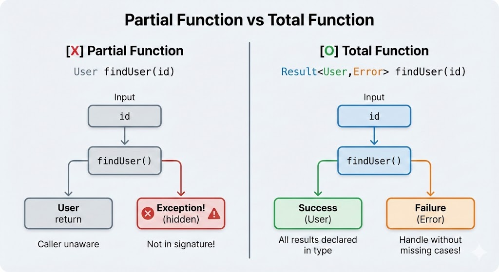

# Chapter 5: 전체 함수와 실패 처리 (Total Functions and Failure Handling)

## 학습 목표 (Learning Objectives)
1. 부분 함수(Partial Function)와 전체 함수(Total Function)의 차이를 설명할 수 있다
2. 예외(Exception)가 왜 "거짓말"인지 이해한다
3. Result 타입을 구현하고 활용할 수 있다
4. "Failure as Data" 패턴을 적용할 수 있다
5. 연쇄적인 실패 처리를 우아하게 구현할 수 있다

---

## 5.1 부분 함수의 위험 (The Danger of Partial Functions)

> **Visual Reference - Functional Core / Imperative Shell:**
> See [Kenneth Lange - Functional Core, Imperative Shell](https://kennethlange.com/functional-core-imperative-shell/) for pattern explanation
> See [Ploeh Blog - Restaurant Sandwich](https://blog.ploeh.dk/2024/12/16/a-restaurant-sandwich/) for practical example

> **다른 말로 (In other words):**
> - "부분 함수: 일부 입력에 대해서만 결과를 반환하고 나머지는 예외를 던지는 함수"
> - "시그니처가 거짓말을 하면 호출자가 실패 케이스를 놓친다"

> **🎯 왜 배우는가?**
>
> "이 메서드가 언제 예외를 던지는지 어떻게 알지?"라는 불안감을 느낀 적 있으신가요?
> 부분 함수의 위험성을 이해하면 **시그니처만 보고도 실패 가능성을 파악**할 수 있고,
> 전체 함수로 변환하는 동기를 얻을 수 있습니다.

### 부분함수 vs 전체함수 흐름도

**Figure 5.1**: Partial Function vs Total Function



### 시그니처가 거짓말을 한다

**Code 5.1**: 부분 함수 - 거짓말하는 시그니처
```java
// 시그니처: id를 주면 User를 반환
public User findUser(int id) {
    User user = database.find(id);
    if (user == null) {
        throw new NotFoundException("User not found: " + id);
        // 시그니처에는 이 예외에 대한 언급이 없음!
    }
    return user;
}
```

이것이 **부분 함수(Partial Function)**입니다. 입력 중 일부에 대해서만 결과를 반환하고, 나머지는 예외를 던지거나 null을 반환합니다.

### 비유: 은행 창구

> **부분 함수는 불친절한 은행 창구와 같습니다.**
>
> "계좌 잔액 조회"라는 창구에 갔습니다.
> 번호표에는 "계좌번호를 주시면 잔액을 알려드립니다"라고 쓰여있습니다.
>
> 그런데 막상 창구에 가니:
> - "그 계좌는 해지됐어요" (예외)
> - "시스템 점검 중이에요" (예외)
> - "조회 권한이 없어요" (예외)
>
> 번호표에는 이런 경우에 대한 안내가 없었습니다.
>
> **전체 함수는 친절한 은행 창구입니다.**
>
> 번호표에 미리 안내되어 있습니다:
> "결과: 잔액 / 해지된 계좌 / 권한 없음 / 시스템 오류 중 하나"
> 어떤 경우든 반드시 명확한 결과를 받습니다.

---

## 5.2 전체 함수 만들기 (Creating Total Functions)

> **다른 말로 (In other words):**
> - "전체 함수: 모든 입력에 대해 항상 유효한 출력을 반환하는 함수"
> - "실패도 정상적인 반환 값(Result.Failure)으로 표현"

> **🎯 왜 배우는가?**
>
> 예외 처리 코드가 비즈니스 로직보다 많아진 경험이 있으신가요?
> 전체 함수로 설계하면 **모든 실패 케이스가 타입에 명시되어** 놓치는 케이스 없이
> 깔끔하게 처리할 수 있습니다.

**Code 5.2**: 전체 함수 - 정직한 시그니처
```java
public Result<User, UserError> findUser(int id) {
    User user = database.find(id);
    if (user == null) {
        return Result.failure(new UserError.NotFound(id));
    }
    return Result.success(user);
}

// 에러 타입도 명확히 정의
sealed interface UserError {
    record NotFound(int id) implements UserError {}
    record Suspended(int id, String reason) implements UserError {}
    record Deleted(int id, LocalDateTime deletedAt) implements UserError {}
}
```

---

## 5.3 Result 타입 완전 구현 (Complete Result Type Implementation)

> **🎯 왜 배우는가?**
>
> Java에 Rust의 Result나 Kotlin의 Either 같은 게 없어서 아쉬우셨나요?
> 직접 Result 타입을 구현하면 **함수형 에러 처리의 핵심 도구**를 갖추게 되고,
> map/flatMap 체이닝으로 우아한 파이프라인을 구성할 수 있습니다.

**Code 5.3**: Result Sealed Interface 구현
```java
public sealed interface Result<S, F> {
    record Success<S, F>(S value) implements Result<S, F> {}
    record Failure<S, F>(F error) implements Result<S, F> {}

    // 팩토리 메서드
    static <S, F> Result<S, F> success(S value) {
        return new Success<>(value);
    }

    static <S, F> Result<S, F> failure(F error) {
        return new Failure<>(error);
    }

    // 변환 (map)
    default <T> Result<T, F> map(Function<S, T> mapper) {
        return switch (this) {
            case Success(var value) -> Result.success(mapper.apply(value));
            case Failure(var error) -> Result.failure(error);
        };
    }

    // 연쇄 (flatMap)
    default <T> Result<T, F> flatMap(Function<S, Result<T, F>> mapper) {
        return switch (this) {
            case Success(var value) -> mapper.apply(value);
            case Failure(var error) -> Result.failure(error);
        };
    }

    // 양쪽 처리
    default <T> T fold(Function<S, T> onSuccess, Function<F, T> onFailure) {
        return switch (this) {
            case Success(var value) -> onSuccess.apply(value);
            case Failure(var error) -> onFailure.apply(error);
        };
    }
}
```

---

## 5.4 이커머스 실전 예제: 주문 처리 (E-commerce Example: Order Processing)

> **🎯 왜 배우는가?**
>
> 주문 처리 시 "사용자 없음", "재고 부족", "쿠폰 만료" 등 다양한 실패를 어떻게 처리하셨나요?
> 실전 예제를 통해 **복잡한 비즈니스 로직을 Result 파이프라인으로 구성**하는 방법을 익히고,
> 실패 케이스를 누락 없이 처리할 수 있습니다.

**Code 5.4**: OrderError Sealed Interface - 에러 타입 정의
```java
// 에러 타입 정의
sealed interface OrderError {
    record UserNotFound(MemberId id) implements OrderError {}
    record ProductNotFound(ProductId id) implements OrderError {}
    record InsufficientStock(ProductId id, int requested, int available)
        implements OrderError {}
    record InvalidCoupon(CouponCode code, String reason) implements OrderError {}
}
```

**Code 5.5**: Result를 활용한 파이프라인 조합
```java
// 파이프라인 조합
public Result<Order, OrderError> createOrder(CreateOrderRequest request) {
    return findUser(request.userId())
        .flatMap(user -> findProduct(request.productId())
            .flatMap(product -> checkStock(product, request.quantity())
                .flatMap(__ -> validateCoupon(request.couponCode())
                    .map(discount -> buildOrder(user, product, request.quantity(), discount))
                )
            )
        );
}
```

---

## 퀴즈 Chapter 5 (Quiz Chapter 5)

### Q5.1 [개념 확인] 전체 함수
다음 중 전체 함수(Total Function)의 특징은?

A. 항상 성공을 반환한다<br/>
B. 모든 입력에 대해 정의된 결과를 반환한다<br/>
C. 예외를 던지지 않으면 전체 함수다<br/>
D. void를 반환하면 전체 함수다

---

### Q5.2 [코드 분석] 부분 함수 식별
다음 중 부분 함수(Partial Function)는?

```java
// A
int divide(int a, int b) {
    return a / b;
}

// B
Result<Integer, String> safeDivide(int a, int b) {
    if (b == 0) return Result.failure("0으로 나눌 수 없습니다");
    return Result.success(a / b);
}
```

A. A만<br/>
B. A와 B 모두<br/>
C. B만<br/>
D. 없음

---

### Q5.3 [코드 분석] Result 활용
다음 코드의 결과는?

```java
Result<Integer, String> result = Result.success(10)
    .map(x -> x * 2)
    .flatMap(x -> x > 15
        ? Result.success(x)
        : Result.failure("값이 너무 작습니다"));

result.getOrElse(-1);
```

A. 20<br/>
B. 10<br/>
C. -1<br/>
D. "값이 너무 작습니다"

---

### Q5.4 [설계 문제] 에러 타입 설계
"쿠폰 적용" 기능의 실패 경우를 Result 에러 타입으로 설계하세요.
실패 경우: 쿠폰 없음, 이미 사용됨, 만료됨, 최소 주문금액 미달

A. 모두 String으로 처리<br/>
B. sealed interface로 각 경우를 record로 정의<br/>
C. enum으로 정의<br/>
D. Exception으로 처리

---

### Q5.5 [코드 작성] 전체 함수 변환
다음 부분 함수를 전체 함수로 변환하세요.

```java
public User withdraw(UserId id, Money amount) {
    User user = userRepository.find(id)
        .orElseThrow(() -> new UserNotFoundException(id));

    if (user.balance().lessThan(amount)) {
        throw new InsufficientBalanceException(user.balance(), amount);
    }

    return user.withdraw(amount);
}
```

---

정답은 Appendix C에서 확인할 수 있습니다.
