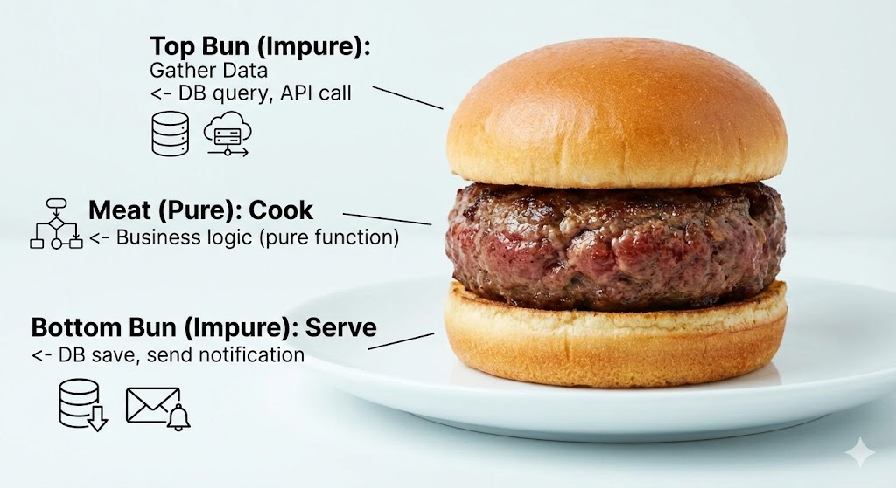

# Chapter 6: 파이프라인과 결정론적 시스템 (Pipeline and Deterministic Systems)

## 학습 목표 (Learning Objectives)
1. 결정론적(Deterministic) 함수의 정의와 장점을 설명할 수 있다
2. 순수 함수(Pure Function)를 작성할 수 있다
3. 샌드위치 아키텍처의 구조를 이해하고 적용할 수 있다
4. 비즈니스 로직에서 I/O를 격리하는 방법을 알 수 있다
5. 테스트 가능한 코드를 설계할 수 있다

---

## 6.1 결정론적 함수란? (What is a Deterministic Function?)

> **다른 말로 (In other words):**
> - "결정론적 함수: 같은 입력이면 항상 같은 출력, 부수 효과 없음"
> - "순수 함수(Pure Function): 외부 상태를 읽지도 쓰지도 않는 함수"

> **🎯 왜 배우는가?**
>
> "같은 코드인데 왜 어제는 되고 오늘은 안 되지?"라는 경험이 있으신가요?
> 결정론적 함수를 이해하면 **테스트가 항상 동일한 결과를 보장**하고,
> 디버깅 시 재현 가능한 상황을 만들 수 있습니다.

**Code 6.1**: 결정론적 함수 (순수 함수)
```java
// 결정론적 함수 (순수 함수)
public static Money calculateTotal(List<OrderItem> items) {
    return items.stream()
        .map(item -> item.unitPrice().multiply(item.quantity().value()))
        .reduce(Money.zero(), Money::add);
}
```

**Code 6.2**: 비결정론적 함수 (부수효과 포함)
```java
// 비결정론적 함수
public Money calculateTotal(List<OrderItem> items) {
    // 외부 상태(taxRate) 참조 - 비결정론적
    TaxRate taxRate = taxService.getCurrentRate();
    return items.stream()
        .map(item -> item.unitPrice().multiply(item.quantity().value()))
        .reduce(Money.zero(), Money::add)
        .applyTax(taxRate);
}
```

### 비유: 자판기 vs 바리스타

> **결정론적 함수는 자판기와 같습니다.**
>
> **자판기 (결정론적)**:
> - 500원 + 커피 버튼 → 항상 같은 커피
> - 몇 시에 눌러도, 누가 눌러도 같은 결과
> - 예측 가능하고, 테스트하기 쉬움
>
> **바리스타 (비결정론적)**:
> - "커피 주세요" → 바리스타 기분, 재료 상태, 시간에 따라 다른 커피
> - 같은 주문이어도 결과가 다를 수 있음
> - 예측 불가능하고, 테스트하기 어려움

---

## 6.2 샌드위치 아키텍처 (Sandwich Architecture)

> **다른 말로 (In other words):**
> - "I/O(Impure) → 비즈니스 로직(Pure) → I/O(Impure) 구조"
> - "순수한 비즈니스 로직을 불순한 I/O 레이어 사이에 끼워넣는 패턴"

> **🎯 왜 배우는가?**
>
> 비즈니스 로직 중간에 DB 호출이 섞여 있어서 테스트하기 어려우셨나요?
> 샌드위치 아키텍처를 적용하면 **순수 함수로 핵심 로직을 분리**하여
> Mock 없이도 테스트할 수 있고, I/O를 명확히 격리할 수 있습니다.

**Figure 6.1**: Sandwich Architecture Structure
```
┌─────────────────────────────────────┐
│  Top Bun (Impure): Gather Data      │  <- DB query, API call
├─────────────────────────────────────┤
│  Meat (Pure): Cook                  │  <- Business logic (pure function)
├─────────────────────────────────────┤
│  Bottom Bun (Impure): Serve         │  <- DB save, send notification
└─────────────────────────────────────┘
```


> **Visual Reference - Sandwich Architecture (Functional Core / Imperative Shell):**
> 
> *Source: [Kenneth Lange - Functional Core, Imperative Shell](https://kennethlange.com/functional-core-imperative-shell/)*

### ❌ 안티패턴: I/O와 로직 혼합

**왜 문제인가?**
- **테스트 불가능**: 순수 로직만 테스트하려 해도 DB, API Mock이 필요
- **예측 불가능**: 외부 상태에 따라 결과가 달라짐
- **재사용 불가**: 다른 컨텍스트에서 로직만 재사용 불가능

**Code 6.3**: I/O가 로직에 섞여있음 (안티패턴)
```java
// 안티패턴: 비즈니스 로직 중간에 I/O
public Order processOrder(OrderRequest request) {
    User user = userRepository.find(request.userId()).orElseThrow();

    if (user.grade() == Grade.VIP) {
        Coupon vipCoupon = couponService.getVipCoupon();  // I/O in middle!
        request = request.withCoupon(vipCoupon);
    }

    Money total = calculateTotal(request.items());
    TaxRate taxRate = taxService.getCurrentRate();  // I/O in middle!
    total = total.applyTax(taxRate);

    Order order = new Order(user.id(), request.items(), total);
    return orderRepository.save(order);
}
```

### ✅ 권장패턴: 샌드위치 구조 적용

**왜 좋은가?**
- **순수 함수 테스트**: 비즈니스 로직을 Mock 없이 단위 테스트 가능
- **명확한 경계**: I/O와 로직의 책임이 명확히 분리됨
- **재사용 가능**: 순수 함수는 다른 컨텍스트에서도 재사용 가능

**Code 6.4**: 샌드위치 구조 적용 (DOP 권장)
```java
public Result<Order, OrderError> processOrder(OrderRequest request) {
    // === Top Bun: 데이터 수집 (Impure) ===
    Optional<User> userOpt = userRepository.find(request.userId());
    if (userOpt.isEmpty()) {
        return Result.failure(new OrderError.UserNotFound(request.userId()));
    }
    User user = userOpt.get();
    Optional<Coupon> coupon = user.grade() == Grade.VIP
        ? couponService.getVipCoupon()
        : Optional.empty();
    TaxRate taxRate = taxService.getCurrentRate();

    // === Meat: 비즈니스 로직 (Pure) ===
    Money total = OrderCalculations.calculateTotal(request.items(), coupon, taxRate);
    Order order = OrderCalculations.createOrder(user.id(), request.items(), total);

    // === Bottom Bun: 부수효과 (Impure) ===
    Order savedOrder = orderRepository.save(order);
    notificationService.sendOrderConfirmation(savedOrder);

    return Result.success(savedOrder);
}
```

---

## 퀴즈 Chapter 6 (Quiz Chapter 6)

### Q6.1 [개념 확인] 순수 함수
다음 중 순수 함수는?

```java
// A
int add(int a, int b) { return a + b; }

// B
int addWithLog(int a, int b) {
    System.out.println("Adding " + a + " + " + b);
    return a + b;
}

// C
int addWithCounter(int a, int b) {
    counter++;  // 클래스 필드
    return a + b;
}
```

A. A만<br/>
B. A와 B<br/>
C. A, B, C<br/>
D. 모두 순수하지 않음

---

### Q6.2 [개념 확인] 샌드위치 아키텍처
샌드위치 아키텍처에서 "Meat" 레이어의 특징은?

A. 데이터베이스 접근을 담당한다<br/>
B. 알림 발송을 담당한다<br/>
C. 순수한 비즈니스 로직만 포함한다<br/>
D. 외부 API 호출을 담당한다

---

### Q6.3 [코드 분석] I/O 격리
다음 코드의 문제점은?

```java
public Money calculatePrice(ProductId id, int quantity) {
    Product product = productRepository.find(id).orElseThrow();
    TaxRate rate = taxService.getCurrentRate();
    return product.price().multiply(quantity).applyTax(rate);
}
```

A. 문제없음<br/>
B. 비즈니스 로직 안에 I/O가 섞여있음<br/>
C. 예외를 던지는 것이 문제<br/>
D. 메서드가 너무 짧음

---

### Q6.4 [설계 문제] 리팩토링
Q6.3의 코드를 샌드위치 구조로 리팩토링하면?

A. 그대로 둔다<br/>
B. Product, TaxRate를 파라미터로 받는 순수 함수로 분리<br/>
C. 모든 로직을 Repository로 이동<br/>
D. Try-catch로 감싼다

---

### Q6.5 [코드 작성] 순수 함수 추출
다음 코드에서 순수 함수를 추출하세요.

```java
public Order applyPromotion(OrderId orderId) {
    Order order = orderRepository.find(orderId).orElseThrow();
    Promotion promo = promotionService.getActivePromotion();

    Money discount = order.total().multiply(promo.rate());
    Money newTotal = order.total().subtract(discount);

    Order updatedOrder = order.withTotal(newTotal);
    return orderRepository.save(updatedOrder);
}
```

---

정답은 Appendix C에서 확인할 수 있습니다.

---

> **💡 Q&A: mapToDouble() vs map() - 성능 차이가 있나요?**
>
> **결론**: 숫자를 다룰 때는 `mapToInt/Double`을 쓰는 것이 성능과 편의성 모두 좋습니다.
>
> **이유 1: 박싱/언박싱 패널티**
> - `map()` 사용 시: int → Integer 포장(Boxing) 필요 → 메모리 낭비 & CPU 연산 추가
> - `mapToInt()` 사용 시: IntStream으로 변환되어 포장 없이 int 그대로 처리
>
> **이유 2: 숫자 전용 API 제공**
> - `IntStream`/`DoubleStream`에는 `.sum()`, `.average()`, `.max()`, `.min()` 등 편리한 메서드 제공
> - 일반 `Stream<Integer>`에서는 `.reduce()`를 써야 해서 번거로움
>
> **Code 6.5**: 숫자 스트림 비교
> ```java
> // 권장: 숫자 전용 스트림
> int total = items.stream()
>     .mapToInt(Item::quantity)
>     .sum();
>
> // 비권장: 박싱 오버헤드
> Integer total = items.stream()
>     .map(Item::quantity)
>     .reduce(0, Integer::sum);
> ```
